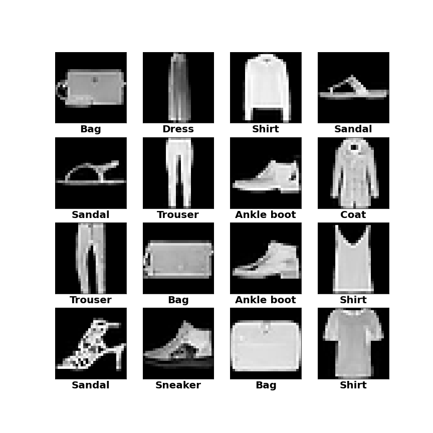
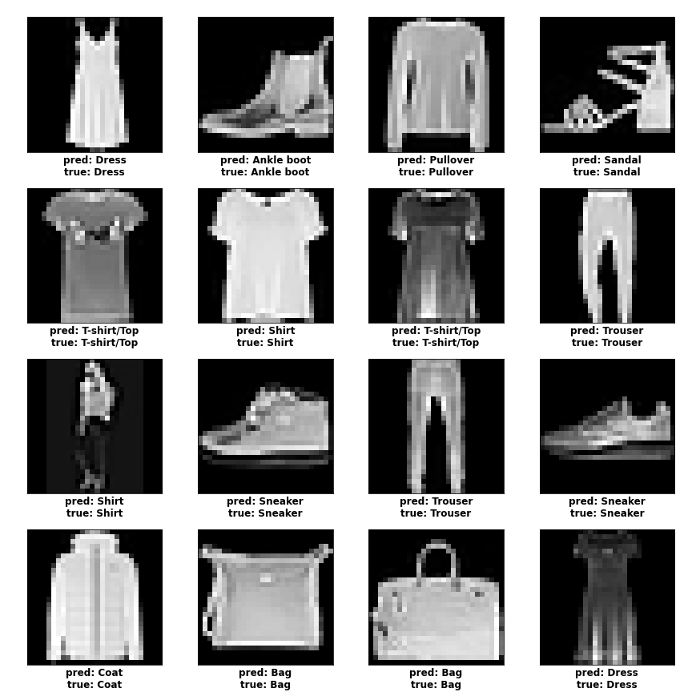

# Fashion-mnist-classification

A deep laerning model for classification of fashion images into 10 classes
1. T-shirt/top
2. Trouser
3. Pullover
4. Dress
5. Coat
6. Sandal
7. Shirt
8. Sneaker
9. Bag
10. Ankle boot

The dataset is from kaggle ([link](https://www.kaggle.com/zalando-research/fashionmnist)).
\
It contains 60,000  28 x 28 gray scale images for training and 10,000 images for testing.
\
Some image samples
\

Validation accuracy achieved : __98.06%__
\
some predictions:
\

[the model architecture](model.png)
